# Laptop Registratie – Gebruikersgids

Een complete gids voor het beheer van laptops en leerlingen in het Laptop Registratie-systeem.

---

## Inhoudsopgave

1. [Overzicht](#overzicht)
2. [Tab: Tickets](#tab-tickets)
3. [Tab: Registreer](#tab-registreer)
4. [Tab: Instellingen](#tab-instellingen)
5. [Tab: Foto's](#tab-fotos)
6. [Mobiele foto-pagina](#mobiele-foto-pagina)
7. [Barcodes & Navigatie](#barcodes--navigatie)
8. [Veelgestelde vragen](#veelgestelde-vragen)
9. [Support & Troubleshooting](#support--troubleshooting)

---

## Overzicht

**Laptop Registratie** is een web-applicatie voor het registreren en beheren van laptopuitkering aan leerlingen. Het systeem houdt bij welke leerling welke laptop heeft, volgt problemen (tickets) per laptop, en ondersteunt fotodocumentatie.

### Schermindeling

De app heeft één topbalk met de **brand**, vier **hoofdtabs**, een globaal **scanveld** (altijd zichtbaar) en rechts een **theme-toggle** + **help**.

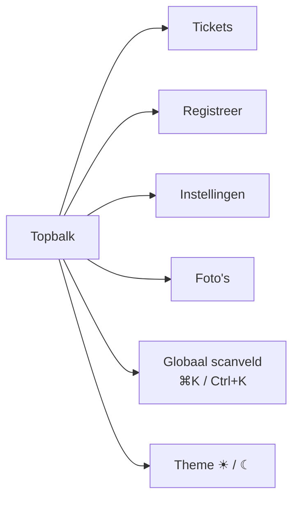

### Starten

Navigeer naar `https://localhost` (of je productie-URL). De **Tickets**-tab opent standaard.

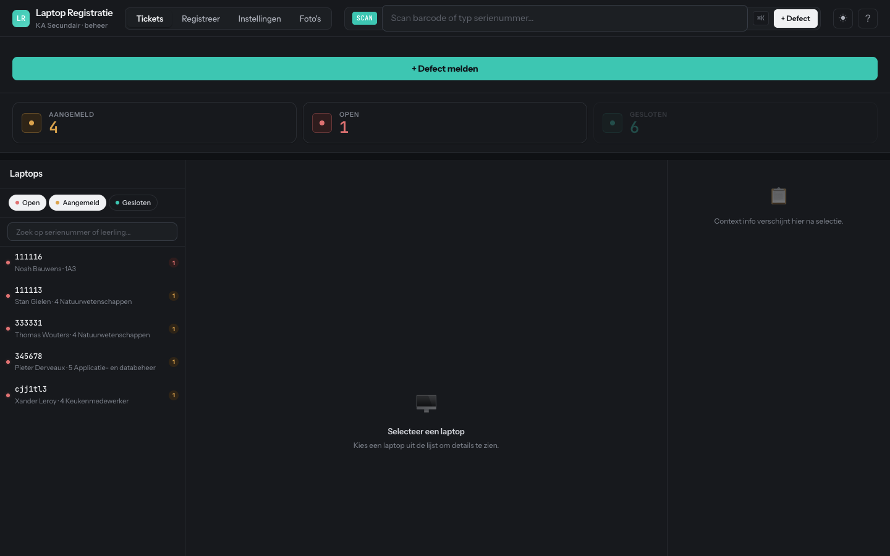

---

## Tab: Tickets

De **issue/probleemtracker** voor laptops. Registreer defecten, volg de tijdlijn en markeer als opgelost. Dit is de standaard-tab.


### Indeling

- **Bovenaan**: groene knop **+ Defect melden** (snelle nieuwe melding)
- **KPI-kaarten**: tellers per status — klik om te filteren
- **Linker paneel** (Laptops): chip-filters (Open / Aangemeld / Gesloten) + zoekveld + lijst van laptops met openstaande issues
- **Midden**: detailweergave van het geselecteerde laptop met toestelinfo, uitleengeschiedenis en defectgeschiedenis
- **Rechter paneel** (Leerling): naam, snelle acties (Foto's bekijken, Vernieuwen, Exporteer historiek) en CSV-export

### Workflow — probleem melden

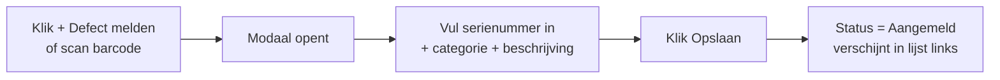

Het modaal:

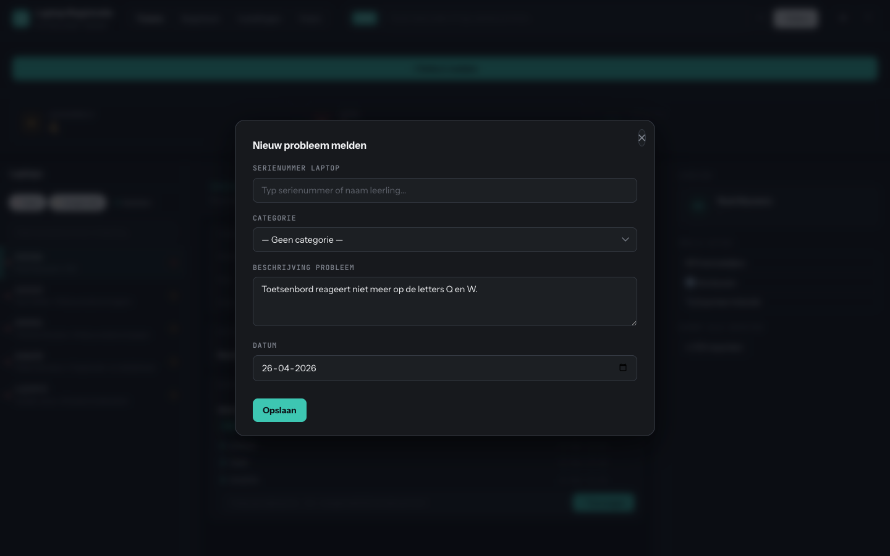

> **Tip**: Het serienummer in het globale scanveld bovenaan wordt automatisch overgenomen als startwaarde. Scan eerst de laptop, klik dan op **+ Defect**.

### Detailweergave en tijdlijn

Selecteer een laptop in de linkerlijst om alle informatie te zien:

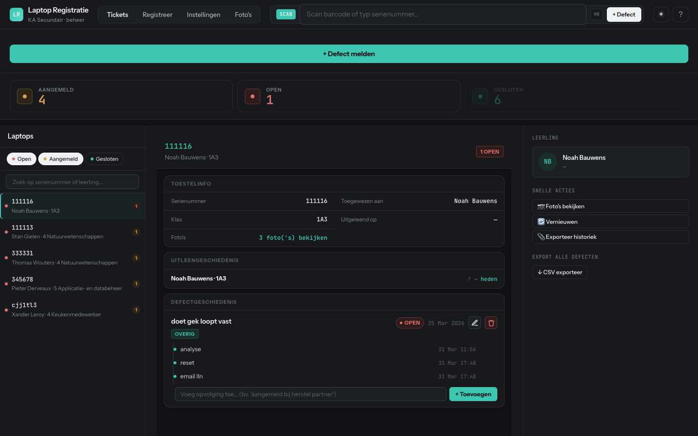

Per defect zie je:

- **Status-badge** (Open / Aangemeld / Gesloten) en categorie
- **Beschrijving** + datum gerapporteerd
- **Tijdlijn met entries** — voortgang en acties (bv. "analyse", "reset", "email lln")
- **Bewerk** ✎ of **Verwijder** 🗑 knoppen rechtsboven

### Entry toevoegen aan een ticket

1. Selecteer het defect in de detailweergave
2. Typ in het invoerveld onderaan: bv. _"aangemeld bij herstel partner"_
3. Klik **+ Toevoegen**

Elke entry krijgt een tijdstempel — handig voor opvolging en rapportage.

### Status-filters

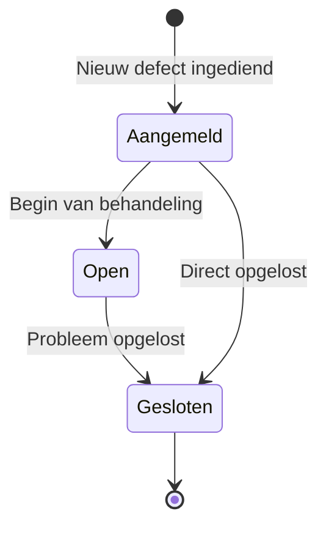

Klik op een **KPI-kaart** of een **chip** in de linker filter-rij om op status te filteren. Meerdere statussen tegelijk is mogelijk.

### Exports

In het rechter paneel:

- **Exporteer historiek** — download alle defecten van de geselecteerde laptop
- **CSV exporteer** (Export alle defecten) — download alle problemen, inclusief gesloten

---

## Tab: Registreer

Je **primaire werkplek** bij massa-uitreiking of terugname. De tab heeft een 3-stap wizard met barcode-panelen aan weerszijden voor scanner-only workflows.

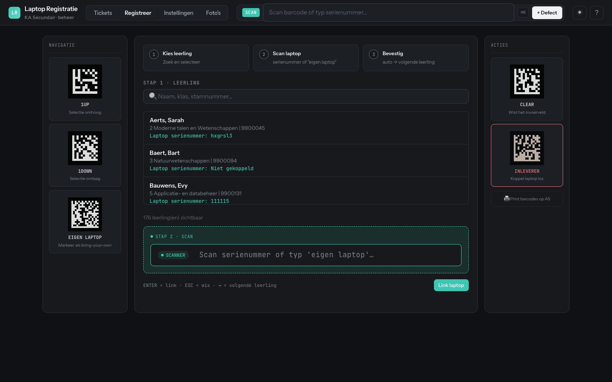

### Indeling

| Sectie | Inhoud |
|--------|--------|
| **Links — Navigatie** | Barcodes voor `1UP`, `1DOWN`, `EIGEN LAPTOP` (printbaar) |
| **Midden — Wizard** | Stap 1: leerling kiezen · Stap 2: laptop scannen · Stap 3: bevestigen |
| **Rechts — Acties** | Barcodes voor `CLEAR`, `INLEVEREN` + "Print barcodes op A5" |

### Workflow — laptop koppelen

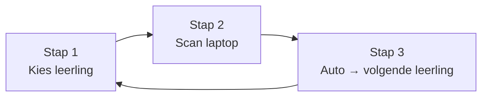

Na een succesvolle koppeling springt de focus terug naar het scanveld én wordt automatisch de **volgende leerling** in de lijst geselecteerd. Je kunt dus 30 laptops in 3-4 minuten koppelen zonder muis.

### Voorbeeld: leerling geselecteerd, klaar voor scan

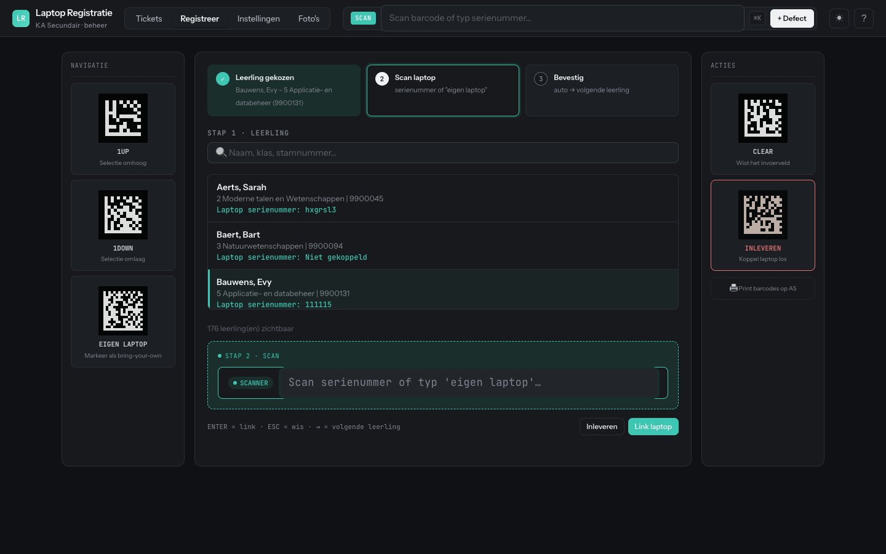

Let op de status-indicator bovenaan: **Stap 1** krijgt een groene check, **Stap 2** wordt actief.

### Speciale barcodes

| Barcode | Functie | Opmerking |
|---------|---------|-----------|
| `1UP` | Vorige leerling selecteren | Snelle navigatie |
| `1DOWN` | Volgende leerling selecteren | Snelle navigatie |
| `EIGEN LAPTOP` | Markeer als eigen toestel | Leerling hoeft geen uitgedeelde laptop |
| `CLEAR` | Zoekveld leegmaken | Snelle reset |
| `INLEVEREN` | Laptop terugkoppelen | Alleen als leerling geselecteerd |

> **Tip**: Klik **"Print barcodes op A5"** rechtsonder om een A5 met alle navigatie- en actie-barcodes te printen — leg deze naast de scanner voor scanner-only werk.

### Conflictdetectie

Wanneer je een laptop probeert te koppelen aan een leerling die er al één heeft:
- Systeem waarschuwt: `Leerling heeft al laptop(s): [serienummer]`
- Kies **Overschrijven** om de oude koppeling te verbreken
- Of **Cancel** om af te zien

### Sneltoetsen in stap 2

| Toets | Actie |
|-------|-------|
| `Enter` | Link laptop |
| `Esc` | Wis invoer |
| `→` | Volgende leerling |

---

## Tab: Instellingen

Beheer de basis-data: leerlingen importeren/verwijderen, laptops aanmaken/bewerken. De tab gebruikt een **linker sidebar** voor de twee secties (Studenten · Laptops) en een **filter-overzicht** met counts.

### Sectie: Studenten

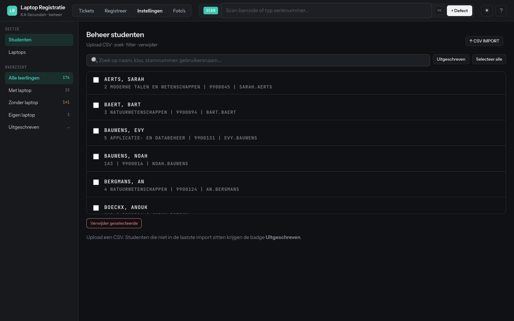

#### Filters in de sidebar

| Filter | Toont |
|--------|-------|
| **Alle leerlingen** | Iedereen (totaal-count) |
| **Met laptop** | Leerlingen met gekoppelde laptop |
| **Zonder laptop** | Leerlingen zonder laptop |
| **Eigen laptop** | Leerlingen met "EIGEN LAPTOP" gemarkeerd |
| **Uitgeschreven** | Niet meer in de meest recente import |

#### Leerlingen importeren (CSV)

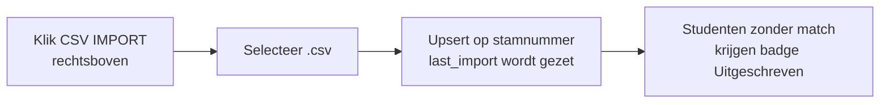

CSV-formaat (puntkomma-gescheiden):

```csv
Instellingsnummer;Naam;Voornaam;Klas;Klascode;Klasnummer;Gebruikersnaam;Pointer;Stamnummer;
027938;Aerts;Sarah;2 Moderne talen en Wetenschappen;2MTW;1;sarah.aerts;900045;9900045;
```

- Bestaande leerlingen worden bijgewerkt (upsert op `Stamnummer`)
- Nieuwe leerlingen worden toegevoegd
- `last_import` timestamp wordt op de import-tijd gezet

#### Leerlingen zoeken en filteren

- **Zoekveld** zoekt op: stamnummer, naam, voornaam, klas, klascode, klasnummer, gebruikersnaam, pointer
- **Toon uitgeschreven** — toggle om uitgeschreven leerlingen mee te tonen
- **Selecteer alle** — vink alle zichtbare rijen aan

#### Leerlingen verwijderen

1. Vink één of meer rijen aan (checkbox links per rij)
2. Optioneel: klik **Selecteer alle** om alle zichtbare leerlingen aan te vinken
3. Klik **Verwijder geselecteerde** (rode knop onderaan)
4. Bevestig de actie

> Bijbehorende laptopkoppeling wordt mee verwijderd. Wil je dat voorkomen, ontkoppel de laptop eerst (zie [FAQ](#veelgestelde-vragen)).

### Sectie: Laptops

Klik **Laptops** in de sidebar om naar het laptop-overzicht te wisselen.

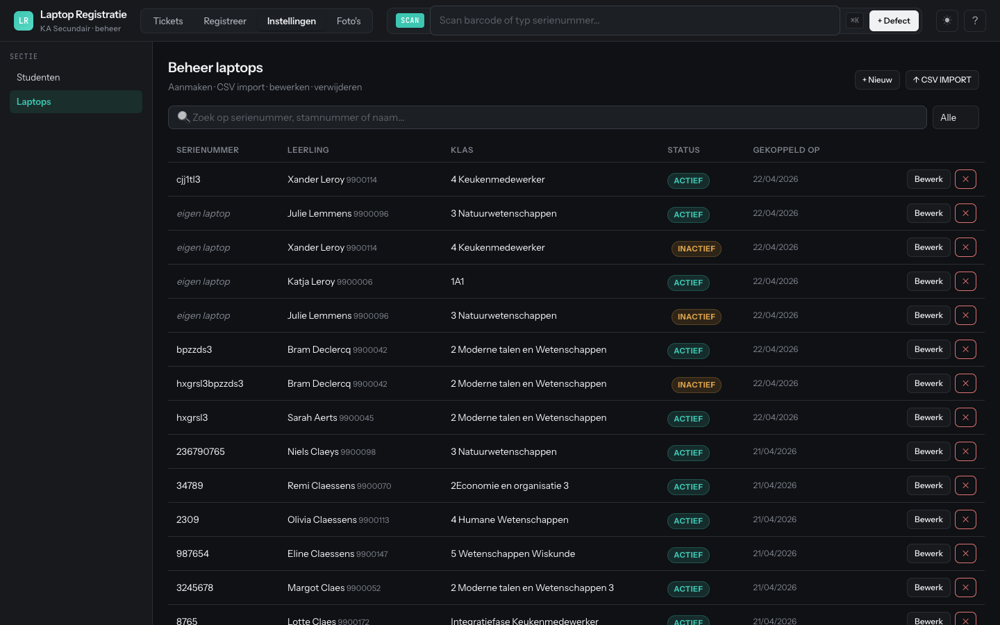

Kolommen:

| Kolom | Inhoud |
|-------|--------|
| **Serienummer** | Hardware-ID of `eigen laptop` |
| **Leerling** | Naam + stamnummer |
| **Klas** | Huidige klas van leerling |
| **Status** | `ACTIEF` (groen) of `INACTIEF` (geel) |
| **Gekoppeld op** | Datum van eerste koppeling |
| **Acties** | Bewerk · Verwijder |

#### Nieuwe laptop toevoegen

1. Klik **+ Nieuwe** rechtsboven
2. Vul **Serienummer** in (bv. `LNVG6X00AA8A`)
3. Optioneel: vul **Stamnummer** om direct te koppelen
4. Klik **Toevoegen**

#### Laptop bewerken / verwijderen

- **Bewerk** — wijzig serienummer of stamnummer
- **Verwijder** (×) — bevestig de permanente verwijdering

---

## Tab: Foto's

Documenteer de toestand van laptops met foto's. Handig voor schade-inventaris en garantie-aanvragen.

### Lege staat

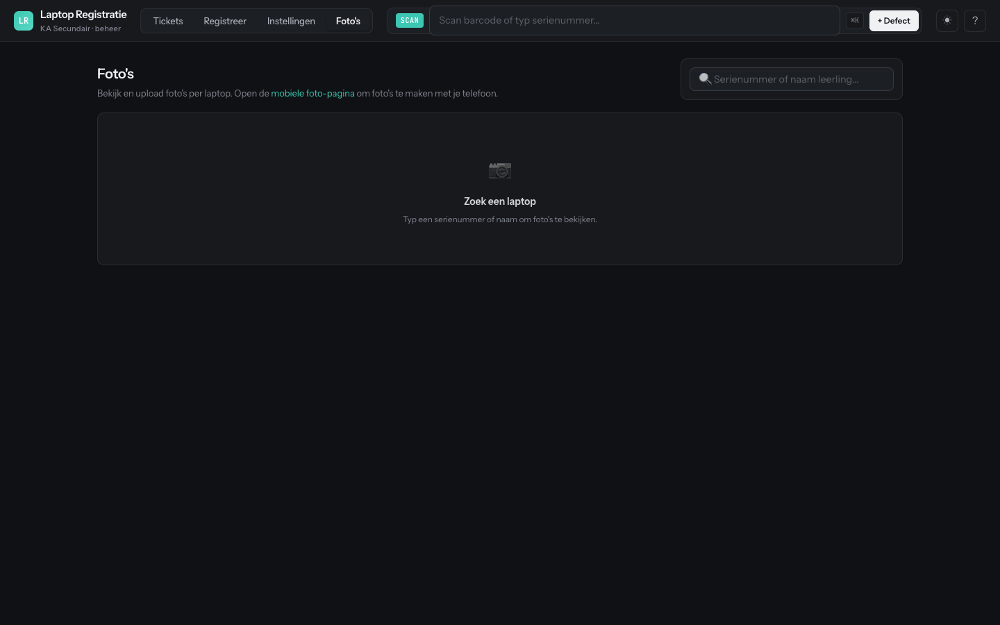

Typ een **serienummer** of **naam leerling** in het zoekveld rechtsboven. Suggesties verschijnen automatisch.

### Galerie geladen

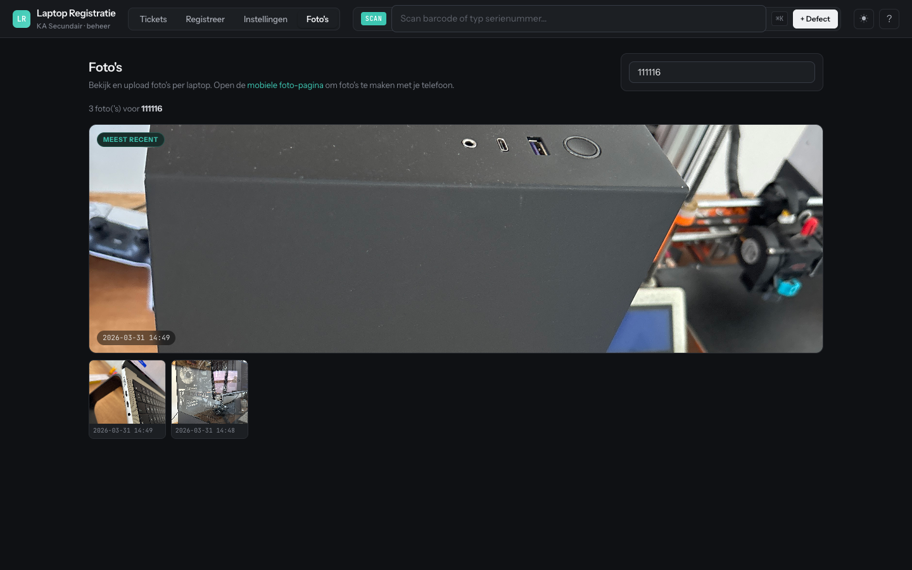

- **Thumbnails** links onderaan — klik om te wisselen
- **Hoofdweergave** boven — klik voor lightbox (zoom + pan)
- **Datum** per foto onderaan de thumbnail
- **+ Nieuw / Upload** knop om nieuwe foto's toe te voegen

### Lightbox

Klik op de hoofdfoto:

| Actie | Hoe |
|-------|-----|
| **Zoom in/uit** | Scroll (muiswiel) |
| **Pan** | Click + drag (als ingezoomd) |
| **Sluiten** | Esc-toets of klik buiten de foto |

### Foto verwijderen

1. Open de galerie voor het serienummer
2. Klik **×** op de thumbnail
3. Bevestig

---

## Mobiele foto-pagina

Foto's nemen werkt het best vanaf een telefoon. Open `https://<jouw-server>/photos` op iOS of Android — of klik in de Foto's-tab op de link **mobiele foto-pagina**.

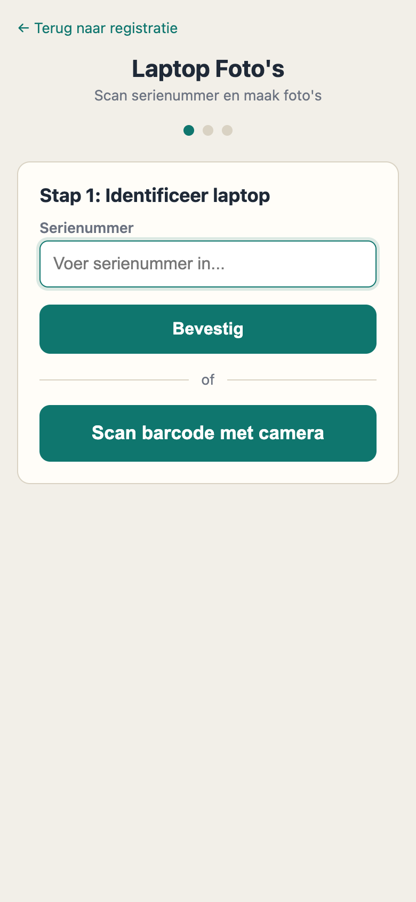

### Stappen

1. **Stap 1: Identificeer laptop** — typ serienummer of klik **Scan barcode met camera**
2. **Stap 2: Maak foto's** — neem foto via camera of kies uit galerij
3. **Stap 3: Bekijk en bevestig** — foto wordt als base64 geüpload (geen bestand-upload nodig — werkt op iOS Safari)

> **Tip**: Maak foto's van **alle vier de zijden** + **boven en onder** voor volledige documentatie. Zorg voor goed licht.

---

## Barcodes & Navigatie

### Globale scanbar (bovenaan)

- Altijd zichtbaar in de topbalk
- **Sneltoets**: `Cmd+K` (Mac) of `Ctrl+K` (Windows/Linux) om te focussen
- Scan een serienummer + Enter → opent de bijbehorende laptop in de Tickets-tab
- Of klik **+ Defect** om direct een nieuw probleem te melden

### Navigatie- en actiebarcodes

Print barcodes in **Code 128** of **Data Matrix**. De Registreer-tab heeft kant-en-klare barcodes ingebouwd, maar je kunt ze ook zelf genereren:

| Barcode | Werkt in | Doel |
|---------|----------|------|
| `1UP` | Registreer | Vorige leerling |
| `1DOWN` | Registreer | Volgende leerling |
| `EIGEN LAPTOP` | Registreer | Markeer als eigen laptop |
| `INLEVEREN` | Registreer | Laptop terugkoppelen |
| `CLEAR` | Overal | Reset zoekveld |

> Klik **Print barcodes op A5** in de Registreer-tab voor een printbare A5 met alle barcodes.

### Themewisselaar

Klik op het icoon **☀** of **☾** rechtsboven om tussen donker en licht te wisselen. Je voorkeur wordt onthouden in de browser.

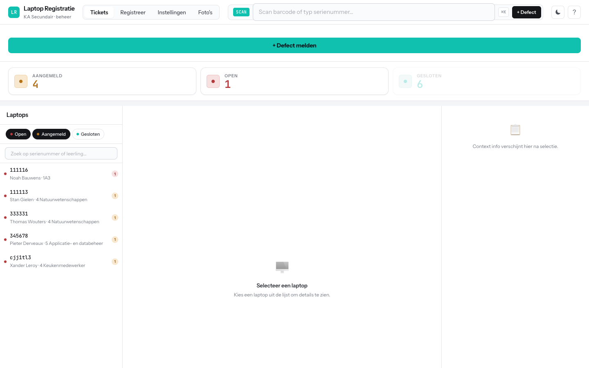

---

## Veelgestelde vragen

### V: Hoe koppel ik snel 30 laptops?

**A**:
1. Zorg dat alle leerlingen geïmporteerd zijn (Instellingen → Studenten → CSV IMPORT)
2. Ga naar **Registreer**
3. Klik leerling aan → scan serienummer → automatisch springt de selectie naar de volgende leerling
4. Of werk volledig met scanner via `1UP` / `1DOWN` barcodes

Duur: ~3–4 minuten per 30 laptops, afhankelijk van scan-snelheid.

### V: Leerling heeft al een laptop, maar ik wil deze vervangen

**A**:
1. Ga naar **Registreer**
2. Selecteer de leerling
3. Voer het NIEUWE serienummer in
4. Systeem waarschuwt: `Leerling heeft al laptop(s): [oud serienummer]`
5. Klik **Overschrijven**
6. De oude koppeling wordt verbroken, de nieuwe wordt ingesteld

### V: Foto's zijn zwart of wazig (mobiel)

**A**:
- Zorg voor goed licht
- Schoon de camera-lens
- Houd de telefoon recht op het toestel
- Wacht tot de focus stabiel is voor je tikt

### V: Kan ik barcodes zelf genereren voor navigatie/acties?

**A**: Ja! Gebruik een barcode-generator voor **Code 128** of **Data Matrix** met deze waarden: `1UP`, `1DOWN`, `EIGEN LAPTOP`, `INLEVEREN`, `CLEAR`. Of gebruik de ingebouwde "Print barcodes op A5" knop in de Registreer-tab.

### V: Hoe verwijder ik een leerling zonder hun laptop te verwijderen?

**A**:
1. Ga naar **Instellingen → Laptops**
2. Zoek het serienummer
3. Klik **Bewerk** en leeg het **Stamnummer**-veld
4. Klik **Opslaan**
5. Nu kun je de leerling verwijderen zonder de laptopgegevens te raken

### V: Waar staan mijn foto's?

**A**: Foto's worden opgeslagen in `/uploads/laptops/<serienummer>/` op de server. Elk bestand krijgt een unieke naam. Ze zijn altijd benaderbaar via de app — handmatige backup is niet vereist maar wel aanbevolen voor bedrijfszekerheid.

### V: Kan ik een export maken van alle gegevens?

**A**:
- **Tickets** → rechter paneel → **Exporteer historiek** (per laptop) of **CSV exporteer** (alles)
- **Studenten / Laptops** → kopieer de tabel naar Excel via je browser, of gebruik de Alembic-export op database-niveau

---

## Snelle referentie

| Actie | Pad | Sneltoets |
|-------|-----|-----------|
| Globaal scanveld focus | Topbalk | `⌘K` / `Ctrl+K` |
| Probleem melden | Tickets → + Defect melden | — |
| Laptop koppelen | Registreer | — |
| Leerlingen importeren | Instellingen → Studenten → CSV IMPORT | — |
| Laptop toevoegen | Instellingen → Laptops → + Nieuwe | — |
| Foto uploaden | Foto's → serienummer typen → upload | — |
| Foto's via telefoon | `/photos` op mobiel | — |
| Theme wisselen | ☀ / ☾ rechtsboven | — |
| Vorige leerling | `1UP` barcode | — |
| Volgende leerling | `1DOWN` barcode | — |

---

## Support & Troubleshooting

### App reageert niet

1. Ververs de pagina (`F5` of `Cmd+R`)
2. Wis browsercache (Instellingen → Privacy → Cookies/Cache)
3. Controleer je internetverbinding
4. Probeer een ander tabblad; navigeer terug

### Barcodescanner werkt niet

- Zorg dat de scanner zich "gedraagt als toetsenbord" (standaard HID-modus)
- Test eerst in een gewoon tekstvak buiten de app
- Controleer of de scanner een **Enter / Carriage Return** stuurt na elke scan

### Foto uploaden mislukt (mobiel)

- Controleer je internetverbinding (WiFi of mobiel data)
- Zorg dat camera-permissies gegeven zijn (iOS: Instellingen → Safari → Camera)
- Probeer een lager-resolutie foto
- Wis browser-cache en probeer opnieuw

### Leerling/laptop verdwenen

- Controleer de filters (bv. **Toon uitgeschreven** in Instellingen → Studenten)
- Zoek op naam of stamnummer
- Bekijk de laatste CSV-import — is de leerling daarin opgenomen?

---

**Versie**: 2.0.0  
**Ondersteunde browsers**: Chrome, Firefox, Safari, Edge (alle moderne versies)  
**Mobiel**: iOS Safari, Android Chrome/Firefox (optimaal)
